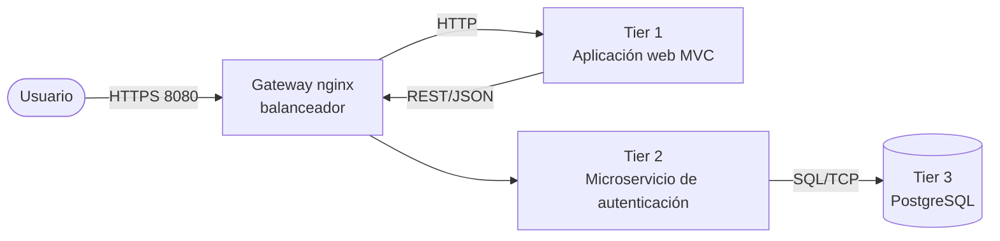
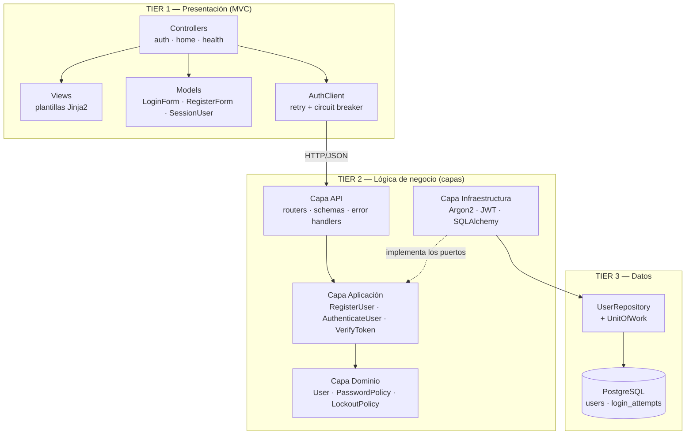
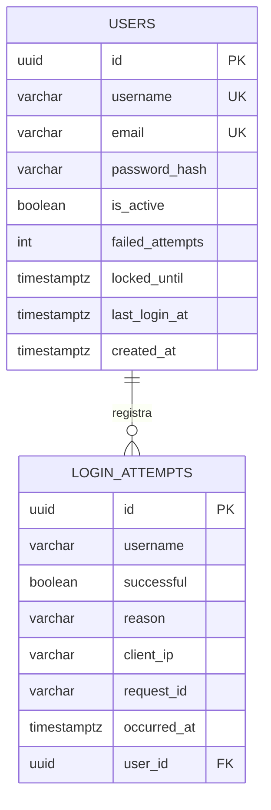
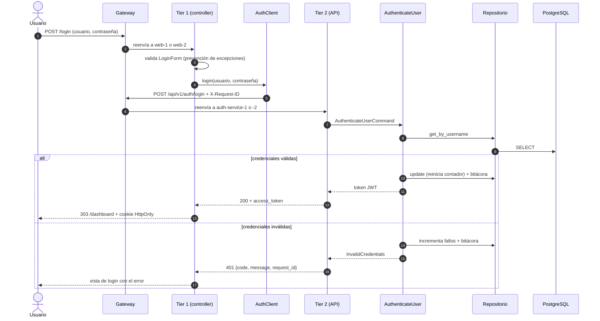
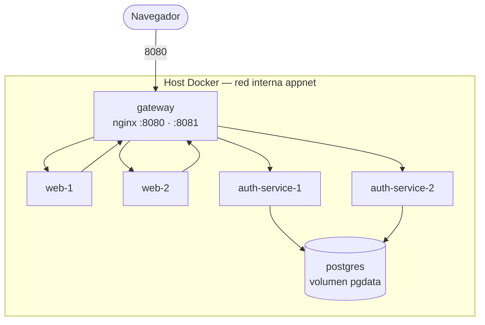

# 01 — Diseño de la arquitectura

## 1. Problema y decisión arquitectónica

Se requiere una aplicación que autentique usuarios (registro, inicio de sesión,
validación de sesión) con una **arquitectura N-tier de tres niveles**, alta
disponibilidad (99.99%), manejo de excepciones y observabilidad en todas las capas.

El estilo elegido es **N-tier (three-tier)** porque:

| Necesidad | Cómo la resuelve el estilo |
|---|---|
| Disponibilidad 99.99% | Cada tier se replica de forma independiente detrás de un balanceador |
| Escalabilidad diferenciada | La presentación y el negocio escalan por separado según su carga |
| Seguridad de los datos | Solo el Tier 2 conoce las credenciales de la base de datos; el Tier 3 no se expone |
| Mantenibilidad | Los cambios de UI no tocan reglas de negocio, y viceversa |

Dentro del Tier 2 se aplica además una **arquitectura en capas con puertos y
adaptadores**: el dominio no depende de FastAPI ni de SQLAlchemy, lo que permite
probarlo de forma aislada y sustituir la infraestructura sin reescribir el negocio.

## 2. Vista de contexto

Todo el tráfico entre tiers pasa por el balanceador, que es quien materializa la
redundancia: ningún componente conoce la dirección concreta de otra instancia.

## 3. Vista de componentes y conectores

**Regla de dependencias del Tier 2:** `api → application → domain`.
La infraestructura solo *implementa* los puertos declarados en `application/ports.py`;
el dominio no importa nada externo. Esto es lo que permite probar los casos de uso
con dobles (`auth-service/tests/fakes.py`) sin base de datos.

## 4. Modelo de datos (Tier 3)

`login_attempts` es la bitácora de auditoría persistente: complementa los logs
con la misma tripleta quién / cuándo / qué, pero consultable con SQL.

## 5. Vista dinámica: inicio de sesión

## 6. Vista de despliegue

Solo el gateway publica puertos. PostgreSQL nunca es alcanzable desde el host.

## 7. Decisiones de diseño (ADR resumidas)

| # | Decisión | Alternativa descartada | Razón |
|---|---|---|---|
| 1 | FastAPI + Jinja2 para el Tier 1 | SPA (React) | El taller pide **MVC**; con plantillas del lado servidor los tres roles (M/V/C) son explícitos y el proyecto queda en un solo lenguaje |
| 2 | JWT en cookie `HttpOnly` | Sesión en memoria del servidor | Un Tier 1 y un Tier 2 **sin estado** se pueden replicar sin sesiones pegajosas ni almacén compartido |
| 3 | Puertos y adaptadores en el Tier 2 | Servicios que usan el ORM directamente | Permite probar el negocio sin base de datos y aísla el cambio de motor |
| 4 | Argon2id para las contraseñas | SHA-256 / MD5 | Resistente a GPU; recomendación OWASP |
| 5 | El Tier 1 valida el token llamando a `/verify` | Que el Tier 1 decodifique el JWT | La autoridad sobre la sesión queda en un solo lugar; el Tier 1 no necesita la clave secreta |
| 6 | nginx como balanceador único | Un balanceador por tier | Replicar el balanceador de entrada requiere infraestructura fuera del alcance de un host Docker único (VIP, multi-nodo); se documenta como SPOF conocido y se explica por qué en producción lo resuelve la plataforma, no la aplicación — ver [02-disponibilidad §3.1](02-disponibilidad.md#31-alcance-de-la-meta-9999-en-este-taller) |
| 7 | Repositorio + Unit of Work | Consultas SQL dispersas | Una transacción por caso de uso hace posible el rollback como táctica de recuperación |

## 8. Trazabilidad requisito → implementación

| Requisito del taller | Dónde está |
|---|---|
| Presentación web con MVC | `web/app/controllers`, `web/app/views`, `web/app/models` |
| Lógica de negocio en microservicio por capas | `auth-service/app/{api,application,domain,infrastructure}` |
| Capa de datos con repositorio | `auth-service/app/infrastructure/persistence/`, `database/init/01-schema.sql` |
| Manejo de excepciones en todas las capas | `domain/exceptions.py`, `infrastructure/exceptions.py`, `api/error_handlers.py`, `web/app/core/exceptions.py` |
| Observabilidad con logs (quién/cuándo/qué) | `*/app/core/logging.py` → ver [03-observabilidad](03-observabilidad.md) |
| Disponibilidad 99.99% | Ver [02-disponibilidad](02-disponibilidad.md) |
| Pruebas | Ver [04-pruebas](04-pruebas.md) |
| Despliegue en Docker | `docker-compose.yml`, `*/Dockerfile`, `gateway/nginx.conf` |
