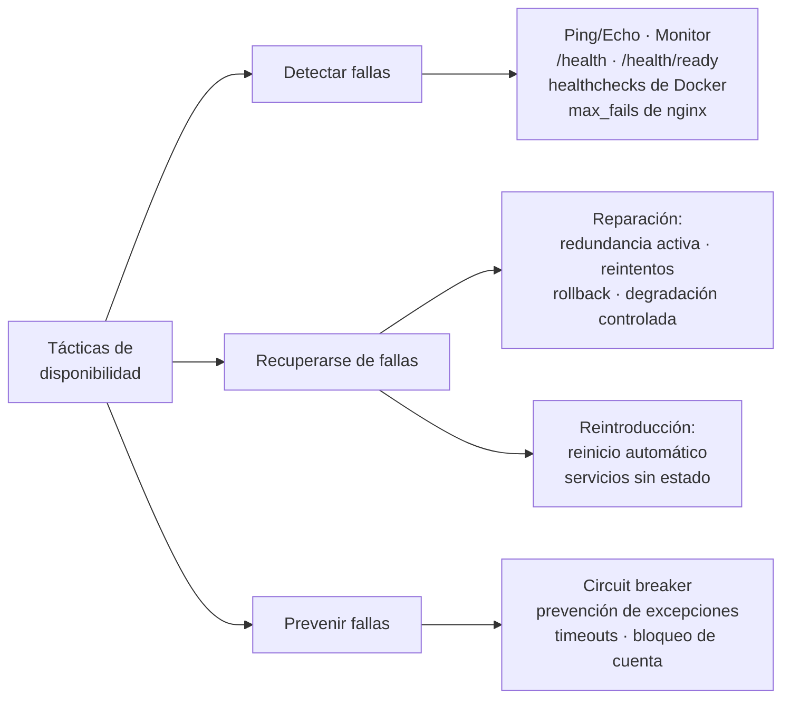

# 02 — Disponibilidad 99.99%

## 1. Qué significa el objetivo

| Disponibilidad | Indisponibilidad máxima al año | Al mes | A la semana |
|---|---|---|---|
| 99.9%  ("tres nueves")   | 8 h 45 min | 43 min 12 s | 10 min 5 s |
| **99.99% ("cuatro nueves")** | **52 min 36 s** | **4 min 23 s** | **1 min 1 s** |
| 99.999% ("cinco nueves") | 5 min 15 s | 26 s | 6 s |

Con 52 minutos al año no hay margen para una intervención manual: **la detección y
la recuperación tienen que ser automáticas**. Esa es la razón de ser de las
tácticas implementadas.

`Disponibilidad = MTBF / (MTBF + MTTR)` — subir el MTBF (prevención) y bajar el
MTTR (detección + recuperación) son las dos únicas palancas.

## 2. Tácticas implementadas (una por rama del árbol de disponibilidad)



### 2.1 Detección de fallas — *Ping/Echo* y *Monitor*

| Mecanismo | Dónde | Qué detecta |
|---|---|---|
| `GET /health` (liveness) | `auth-service/app/api/routers/health.py`, `web/app/controllers/health_controller.py` | Proceso colgado o muerto |
| `GET /health/ready` (readiness) | mismos archivos | Dependencia caída: el Tier 2 verifica PostgreSQL con `SELECT 1`; el Tier 1 verifica el Tier 2 |
| `HEALTHCHECK` de Docker | `*/Dockerfile` (cada 10 s) | Marca el contenedor `unhealthy` |
| `healthcheck` de compose sobre `pg_isready` | `docker-compose.yml` | Estado del Tier 3 antes de arrancar el Tier 2 |
| `max_fails=2 fail_timeout=10s` | `gateway/nginx.conf` | Detección **pasiva**: saca de rotación la instancia que falla |

La distinción liveness/readiness es deliberada: una instancia sin base de datos
**no debe reiniciarse** (el reinicio no arregla la base), debe **salir de rotación**
hasta que la dependencia vuelva.

### 2.2 Recuperación — reparación

| Táctica | Implementación |
|---|---|
| **Redundancia activa** | Dos instancias por tier (`web-1/2`, `auth-service-1/2`) atendiendo simultáneamente detrás de nginx en round-robin |
| **Reintento** | `AuthClient` reintenta 3 veces con backoff exponencial ante error de transporte o 5xx; nginx reintenta en otra instancia (`proxy_next_upstream`). Los 4xx **nunca** se reintentan: son decisiones de negocio |
| **Rollback** | `SqlAlchemyUnitOfWork`: una transacción por caso de uso; si algo falla se revierte y la base queda consistente |
| **Degradación controlada** | Si el Tier 2 no responde, el Tier 1 muestra una página de error 503 legible en lugar de propagar la falla |

### 2.3 Recuperación — reintroducción

| Táctica | Implementación |
|---|---|
| **Reinicio automático** | `restart: unless-stopped` en todos los servicios |
| **Estado no persistente** | La sesión vive en un JWT firmado, no en memoria del servidor: cualquier instancia puede atender cualquier petición y una instancia reiniciada vuelve al pool sin calentamiento |
| **Arranque ordenado** | `depends_on: condition: service_healthy` sobre PostgreSQL; si aun así la base no está, el Tier 2 arranca en estado `not-ready` en vez de entrar en ciclo de reinicios |

### 2.4 Prevención de fallas

| Táctica | Implementación |
|---|---|
| **Circuit breaker** | `web/app/services/circuit_breaker.py`: tras 5 fallas consecutivas corta el tráfico 15 s y prueba con una petición en estado semiabierto. Evita el agotamiento de hilos y el efecto dominó |
| **Prevención de excepciones** | Validación estricta con Pydantic en ambos tiers; políticas de contraseña y de identidad en el dominio; `extra="forbid"` en los contratos |
| **Timeouts en todo borde** | HTTP cliente (3 s), `proxy_*_timeout` de nginx (2–5 s), `pool_timeout` y `connect_timeout` de la base |
| **`pool_pre_ping`** | Descarta conexiones muertas tras un reinicio de PostgreSQL en lugar de fallar la petición |
| **Bloqueo de cuenta** | 5 intentos fallidos → 5 min de bloqueo: limita el ataque de fuerza bruta, que es también una amenaza de disponibilidad |
| **Aislamiento de recursos** | Límites explícitos del pool HTTP y del pool de conexiones a la base |

## 3. Modelo de disponibilidad del sistema

Con dos instancias en paralelo por tier y disponibilidad individual `a`:

```
A_tier(paralelo) = 1 − (1 − a)²
A_sistema        = A_gateway × A_tier1 × A_tier2 × A_postgres
```

Suponiendo `a = 99%` por instancia (una hipótesis conservadora):

| Componente | Configuración | Disponibilidad |
|---|---|---|
| Tier 1 (web) | 2 réplicas | 1 − 0.01² = **99.99%** |
| Tier 2 (auth) | 2 réplicas | 1 − 0.01² = **99.99%** |
| Gateway | 1 instancia | 99.9% ← *punto único de falla* |
| PostgreSQL | 1 instancia | 99.9% ← *punto único de falla* |
| **Sistema** | serie de los cuatro | ≈ **99.78%** |

La redundancia de los tiers de cómputo ya alcanza los cuatro nueves; **el techo lo
imponen los dos componentes no replicados**. Esto es un resultado del diseño, no
una omisión: se documenta explícitamente qué falta para llegar a 99.99% de punta a punta.

### 3.1 Alcance de la meta 99.99% en este taller

El objetivo de disponibilidad se demuestra a nivel de **los tiers de cómputo**
(presentación y lógica de negocio), que es la parte de la arquitectura que este
taller pide diseñar, implementar y desplegar. El gateway y la base de datos quedan
fuera de ese alcance **a propósito**, no por descuido, por dos razones concretas:

1. **Son problemas de infraestructura, no de arquitectura de aplicación.**
   Replicar un balanceador de entrada o una base de datos requiere mecanismos que
   viven por debajo de la aplicación — IP virtual con `keepalived`/VRRP,
   orquestación multi-nodo, replicación de motor de base de datos con failover
   automático (Patroni, `repmgr`) — y que un despliegue de un único host con
   Docker Compose no puede materializar de forma realista: no hay una segunda
   máquina a la que fallar, y una VIP dentro de un solo host no protege contra
   nada que la pérdida de ese host no rompa igual.
2. **En un entorno real este SPOF normalmente ya viene resuelto por la
   plataforma, no por la aplicación.** Un balanceador gestionado (AWS
   ALB/NLB, Google Cloud Load Balancing, un Ingress de Kubernetes con varias
   réplicas) o una base de datos gestionada multi-AZ (RDS Multi-AZ, Cloud SQL
   HA) **ya son redundantes por diseño** sin que el equipo de la aplicación
   tenga que reimplementar VRRP o failover de Postgres a mano. Construir esa
   redundancia dentro de este taller sería reimplementar, con peor fiabilidad
   y para fines puramente didácticos, algo que la infraestructura gestionada
   resuelve mejor.

Por eso la cifra que se reporta en la tabla de la sección 3 (**A_sistema ≈
99.78%**) es honesta y no un intento fallido de llegar a 99.99%: separa con
claridad lo que la arquitectura de la aplicación garantiza (redundancia activa
+ detección + recuperación automática en Tier 1 y Tier 2, verificado con
`chaos.sh` en la sección 5) de lo que le corresponde resolver a la capa de
infraestructura de despliegue en un entorno de producción real. Documentar el
límite explícitamente — en vez de ocultarlo o forzar el número — es en sí mismo
parte de la táctica de disponibilidad: un SPOF conocido y con mitigación
definida es un riesgo gestionado, no una omisión.

## 4. Puntos únicos de falla y su mitigación en producción

| SPOF | Riesgo | Mitigación propuesta | Por qué no se implementa en este taller |
|---|---|---|---|
| PostgreSQL | Pérdida total del servicio | Replicación primaria/secundaria con failover automático (Patroni/`repmgr`), o base gestionada multi-AZ (RDS, Cloud SQL); copias de respaldo con PITR | Requiere un segundo nodo de base de datos y un orquestador de failover; en un solo host Docker no hay a dónde conmutar. En producción esto lo resuelve la base de datos gestionada, no código propio |
| Gateway nginx | Pérdida del punto de entrada | Dos nginx con IP virtual (`keepalived`/VRRP) o un balanceador gestionado (ALB/NLB/Ingress); DNS con múltiples registros A | Una VIP entre dos contenedores del mismo host no protege contra la falla que más importa (la del host); en la nube esta redundancia la da el balanceador gestionado por defecto |
| Host Docker único | Toda la infraestructura en una máquina | Orquestación multi-nodo (Kubernetes/Swarm) con antiafinidad entre réplicas | Fuera del alcance del taller (una sola máquina de desarrollo); es la causa raíz de los dos SPOF anteriores |
| Secretos en `.env` | Compromiso de credenciales | Gestor de secretos (Vault, AWS Secrets Manager) y rotación de la clave JWT | Aceptable para un entorno de taller no expuesto a Internet; documentado como pendiente antes de cualquier despliegue real |

## 5. Evidencia experimental

Ejecutado sobre el despliegue real (`bash scripts/chaos.sh`):

```
== 1. Estado inicial (dos instancias del Tier 2) ==
  línea base: 20/20 peticiones exitosas (0 fallidas)

== 2. Se detiene auth-service-1 ==
  con una instancia caída: 20/20 peticiones exitosas (0 fallidas)
  web sigue respondiendo: HTTP 200

== 3. Se restablece la instancia ==
  tras la recuperación: 20/20 peticiones exitosas (0 fallidas)
```

La caída completa de una instancia del Tier 2 **no produjo ninguna petición
fallida**: nginx la detectó y desvió el tráfico a la instancia sana.

Las tácticas del lado del cliente están verificadas además por pruebas
automatizadas en `web/tests/test_resiliencia.py` (reintentos, no-reintento de
4xx, apertura/semiapertura/cierre del circuito).
