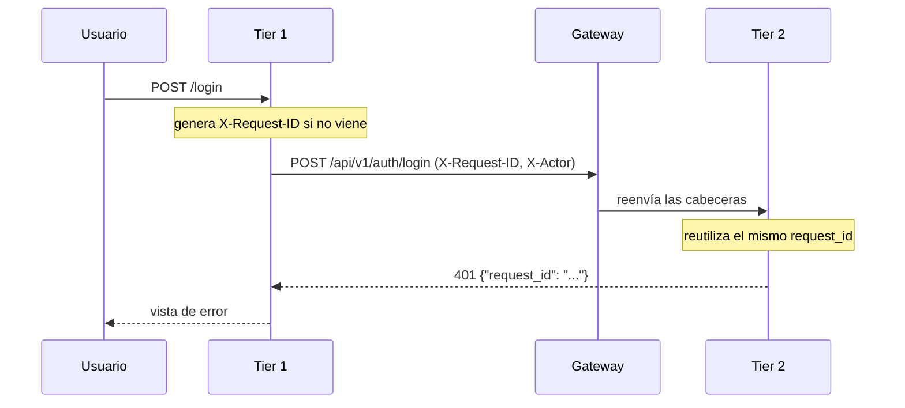
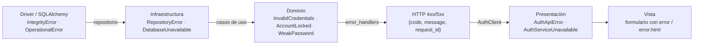

# 03 — Observabilidad y manejo de excepciones

## 1. Formato del log

Requisito del taller: **cada log debe incluir quién, cuándo y qué**. Todos los
servicios emiten JSON por `stdout` (los contenedores no escriben archivos).

| Campo | Rol | Ejemplo |
|---|---|---|
| `timestamp` | **CUÁNDO** — ISO-8601 en UTC | `2026-08-11T17:36:52.748Z` |
| `actor` | **QUIÉN** — usuario, `system` o `anonymous` | `ana.perez` |
| `client_ip` | **QUIÉN** — origen de la petición | `172.19.0.7` |
| `action` | **QUÉ** — operación de negocio | `auth.login` |
| `outcome` | **QUÉ** — resultado | `SUCCESS` / `FAILURE` |
| `message` | **QUÉ** — descripción legible | `Autenticación exitosa` |
| `service`, `tier`, `instance` | Dónde: qué contenedor | `auth-service`, `logica-de-negocio`, `auth-service-1` |
| `layer`, `component` | Dónde: qué capa y clase | `application`, `AuthenticateUser` |
| `request_id` | Correlación entre tiers | `95492b61-…` |
| `duration_ms`, `status_code` | Rendimiento y resultado HTTP | `38.92`, `401` |
| `error_type`, `error_message`, `stacktrace` | Diagnóstico de fallas | |
| `detail` | Contexto adicional del evento | `{"error_code": "invalid_credentials"}` |

Implementación: `auth-service/app/core/logging.py` y `web/app/core/logging.py`
(`JsonFormatter` + función `audit(...)`). Hay **un logger por capa**
(`controllers`, `api`, `application`, `domain`, `infrastructure`), de modo que el
campo `layer` identifica con precisión el punto de la arquitectura.

## 2. Correlación entre los tres tiers



`CorrelationMiddleware` guarda `request_id`, `actor` y `client_ip` en *context
variables*, así que **todos** los logs de la petición los llevan sin tener que
pasarlos por parámetro capa por capa.

Ejemplo real de un login fallido, con la misma traza en los tres registros
(salida recortada de `docker compose logs`):

```json
{"timestamp":"2026-08-11T17:36:52.747676+00:00","service":"auth-service","tier":"logica-de-negocio","instance":"auth-service-1","layer":"application","component":"AuthenticateUser","actor":"smoke_1786469812","client_ip":"172.19.0.7","action":"auth.login","outcome":"FAILURE","message":"Usuario o contraseña incorrectos","request_id":"95492b61-a56c-4bc6-bb74-fd78409fe4b5"}
{"timestamp":"2026-08-11T17:36:52.747856+00:00","service":"auth-service","layer":"api","component":"error_handlers","actor":"smoke_1786469812","action":"api.error","outcome":"FAILURE","request_id":"95492b61-a56c-4bc6-bb74-fd78409fe4b5","detail":{"error_code":"invalid_credentials","status_code":401}}
{"timestamp":"2026-08-11T17:36:52.748829+00:00","service":"web","tier":"presentacion","instance":"web-1","layer":"controllers","component":"auth_controller","actor":"smoke_1786469812","action":"web.login","outcome":"FAILURE","request_id":"95492b61-a56c-4bc6-bb74-fd78409fe4b5"}
```

Consulta útil durante la sustentación:

```bash
docker compose logs | grep 95492b61     # toda la historia de una petición
```

## 3. Qué nunca se registra

`_REDACTED_KEYS` en `core/logging.py` enmascara `password`, `token`,
`access_token`, `authorization` y `password_hash`. La prueba
`test_los_logs_nunca_contienen_credenciales` lo verifica automáticamente.

## 4. Eventos auditados

| Acción | Tier | Cuándo se emite |
|---|---|---|
| `service.startup` / `service.shutdown` | 1 y 2 | Arranque y parada |
| `http.<método><ruta>` | 1 y 2 | Toda petición, con duración y código |
| `web.login`, `web.register`, `web.logout`, `web.dashboard` | 1 | Acciones del usuario en la UI |
| `auth.login`, `auth.register`, `auth.verify_token` | 2 | Casos de uso del negocio |
| `users.add`, `users.update`, `users.get_by_username` | 3 | Operaciones de persistencia (y sus fallas) |
| `uow.commit`, `uow.rollback` | 3 | Ciclo transaccional |
| `breaker.transition`, `breaker.reject` | 1 | Cambios de estado del circuit breaker |
| `health.ready` | 1 y 2 | Cuando una sonda falla |
| `api.error`, `api.validation`, `web.error` | 1 y 2 | Toda excepción manejada |

Además de los logs, la tabla `login_attempts` guarda una **bitácora persistente**
(usuario, resultado, motivo, IP, `request_id`, instante) consultable con SQL.

## 5. Manejo de excepciones: cadena de traducción

Ninguna excepción cruza una frontera de capa sin traducirse, y ninguna llega al
usuario como stacktrace.



| Capa | Excepciones propias | Archivo |
|---|---|---|
| Dominio (Tier 2) | `InvalidCredentials`, `AccountLocked`, `AccountInactive`, `UserAlreadyExists`, `WeakPassword`, `InvalidUsername`, `InvalidToken` | `domain/exceptions.py` |
| Infraestructura (Tier 3) | `RepositoryError`, `DatabaseUnavailable` | `infrastructure/exceptions.py` |
| API (Tier 2) | Mapa explícito excepción → código HTTP + *catch-all* | `api/error_handlers.py` |
| Presentación (Tier 1) | `AuthApiError`, `AuthServiceUnavailable`, `SessionExpired` | `web/app/core/exceptions.py` |

Códigos HTTP emitidos por el microservicio:

| Situación | Código | `code` |
|---|---|---|
| Credenciales incorrectas / token inválido | 401 | `invalid_credentials`, `invalid_token` |
| Cuenta desactivada | 403 | `account_inactive` |
| Usuario o correo ya registrado | 409 | `user_already_exists` |
| Cuenta bloqueada por intentos fallidos | 423 | `account_locked` |
| Contrato o política de contraseña incumplida | 422 | `validation_error`, `weak_password` |
| Base de datos inaccesible | 503 | `database_unavailable` |
| Falla no prevista | 500 | `internal_error` |

Dos garantías verificadas por pruebas:

1. **Nada se filtra al usuario**: las vistas nunca muestran trazas
   (`test_login_con_el_microservicio_caido_muestra_503`).
2. **Nada se pierde para el operador**: el *catch-all* registra la excepción con
   `stacktrace` completo antes de responder.

## 6. Observabilidad activa (métricas y alertas)

Los logs JSON son útiles para investigar un incidente ya ocurrido, pero no
avisan de un problema en curso. Se agregó una capa de métricas y alertas
sobre `docker-compose.yml`, sin tocar la lógica de negocio:

| Componente | Rol | URL |
|---|---|---|
| `prometheus-fastapi-instrumentator` | Expone `/metrics` en cada instancia de `web` y `auth-service` (latencia, conteo de peticiones, códigos HTTP) | `<instancia>:8000/metrics` |
| Gauge `circuit_breaker_state` | Métrica de negocio agregada a mano en `circuit_breaker.py` (0=cerrado, 1=semiabierto, 2=abierto) | expuesta junto a las demás en `/metrics` |
| **Prometheus** | Recolecta las métricas de las 4 instancias de aplicación; evalúa las reglas de alerta | `localhost:9090` |
| **Alertmanager** | Agrupa y muestra las alertas que Prometheus dispara | `localhost:9093` |
| **Grafana** | Visualización; datasource y dashboard quedan provisionados automáticamente, sin configurarlos a mano | `localhost:3000` (admin/admin) |

Reglas de alerta (`monitoring/prometheus/alerts.yml`):

- `InstanceDown` — una réplica deja de responder al scrape por 30s.
- `HighErrorRate` — más del 5% de las peticiones de un job son 5xx en 2 min.
- `CircuitBreakerOpen` — el breaker de `web` hacia `auth-service` está abierto.

Alertmanager no está conectado a Slack/email a propósito (evita depender de
credenciales externas); las alertas se ven en su UI y en
`localhost:9090/alerts`. Agregar un canal real es una sección adicional en
`monitoring/alertmanager/alertmanager.yml`.

Para verlo en acción: `bash scripts/chaos.sh` apaga una instancia del Tier 2 —
la alerta `InstanceDown` pasa a `firing` en unos 30-40s.

Dashboard provisionado (`monitoring/grafana/provisioning/dashboards/overview.json`,
carga automática al arrancar Grafana, sin pasos manuales): "Taller 1 - Visión
general", con paneles de instancias vivas, total de peticiones a todos los
servicios, peticiones/segundo por servicio y tasa de error 5xx por servicio.
El estado del circuit breaker se puede consultar directamente en Prometheus
(`circuit_breaker_state`) o en los logs (`docker compose logs web-1 | grep
breaker`), en vez de tener panel propio en el dashboard.
