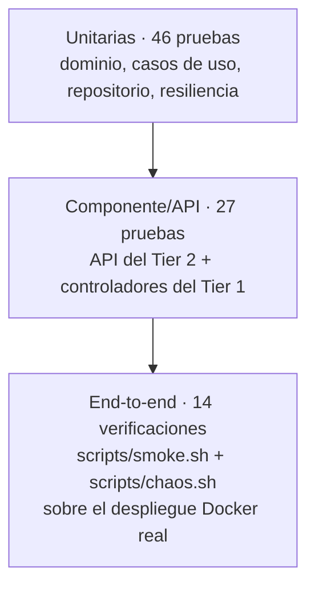

# 04 — Estrategia de pruebas

## 1. Pirámide aplicada al proyecto



Que el dominio se pueda probar sin base de datos y que la presentación se pueda
probar sin el microservicio es la **verificación empírica de que la separación en
capas y tiers es real**, no solo un diagrama.

## 2. Cómo ejecutarlas

```bash
make test        # las 87 pruebas de los dos servicios
make coverage    # con reporte de cobertura
make smoke       # end-to-end contra el despliegue en Docker
make chaos       # demostración de tolerancia a fallas
```

## 3. Resultados

| Suite | Pruebas | Cobertura |
|---|---|---|
| `auth-service` (Tiers 2 y 3) | 60 | 94% |
| `web` (Tier 1) | 27 | 95% |
| `scripts/smoke.sh` (end-to-end) | 14 verificaciones | — |

## 4. Qué cubre cada suite

### Tier 3 — datos (`auth-service/tests/integration/`)

Repositorio y unidad de trabajo **reales** sobre SQLite (mismo código SQLAlchemy
que corre contra PostgreSQL):

- alta y recuperación de usuarios; `exists` distingue el campo en conflicto;
- restricción de unicidad → `UserAlreadyExists`;
- **rollback**: si el caso de uso falla a mitad, no queda nada escrito;
- persistencia de contadores de bloqueo;
- bitácora `login_attempts` con quién / cuándo / qué.

### Tier 2 — dominio y aplicación (`tests/unit/`)

Sin base de datos ni HTTP, con dobles de los puertos (`tests/fakes.py`):

- política de contraseñas e identidad (casos válidos e inválidos);
- reglas de bloqueo de la entidad `User` con **reloj congelado** (sin `sleep`);
- casos de uso: registro, duplicados, login correcto/incorrecto, bloqueo tras N
  intentos y desbloqueo por tiempo, cuenta inactiva, verificación de token.

### Tier 2 — API (`tests/api/`)

Aplicación completa con middlewares y manejadores de error:

- contrato de cada endpoint y sus códigos (201, 401, 409, 422, 423);
- la respuesta de registro **no** incluye contraseña ni hash;
- el mensaje de error no revela si el usuario existe;
- campos extra rechazados (`extra="forbid"`);
- contrato uniforme de error `{code, message, request_id}`;
- `X-Request-ID` del cliente se propaga y se devuelve;
- readiness responde 503 cuando la base no está disponible;
- **observabilidad**: todo log lleva `actor`, `timestamp`, `action` y
  `request_id`, y jamás contiene credenciales.

### Tier 1 — presentación (`web/tests/`)

Con el microservicio simulado:

- flujo MVC completo: login, registro, panel protegido, logout;
- el login exitoso emite cookie `HttpOnly` y redirige (303);
- el formulario inválido **no** genera llamada al Tier 2;
- credenciales incorrectas → se re-renderiza el formulario con el mensaje;
- microservicio caído → página 503 **sin stacktrace**;
- readiness del Tier 1 refleja el estado del Tier 2; liveness no depende de él.

### Resiliencia (`web/tests/test_resiliencia.py`)

- reintento ante error de conexión y ante 5xx;
- **no** se reintenta un 4xx (decisión de negocio);
- agotar los reintentos → `AuthServiceUnavailable` y apertura del circuito;
- circuito abierto → no se llama al microservicio en absoluto;
- transiciones cerrado → abierto → semiabierto → cerrado/abierto;
- propagación de `X-Request-ID` hacia el Tier 2.

## 5. Pruebas end-to-end y de tolerancia a fallas

`scripts/smoke.sh` recorre los tres tiers sobre el despliegue en Docker: salud de
cada tier, registro y login desde la web, panel autenticado, credenciales
incorrectas, duplicados, contraseña débil, emisión y verificación de JWT.

`scripts/chaos.sh` apaga una instancia del Tier 2 y mide la tasa de éxito durante
la falla; el resultado está en [02-disponibilidad](02-disponibilidad.md#5-evidencia-experimental).

## 6. Qué queda fuera del alcance

- Pruebas de carga y de estrés (no se midió el rendimiento bajo concurrencia).
- Failover del Tier 3: PostgreSQL no está replicado en este despliegue.
- Pruebas de seguridad automatizadas (SAST/DAST).
