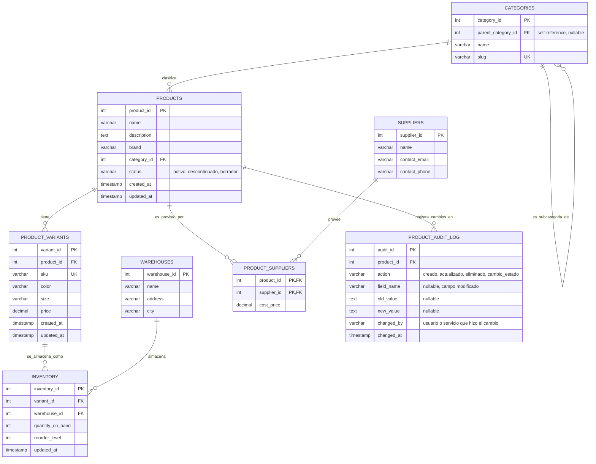

```mermaid
erDiagram
    CATEGORIES ||--o{ CATEGORIES : "es_subcategoria_de"
    CATEGORIES ||--o{ PRODUCTS : "clasifica"

    PRODUCTS ||--o{ PRODUCT_VARIANTS : "tiene"

    PRODUCT_VARIANTS ||--o{ INVENTORY : "se_almacena_como"
    WAREHOUSES ||--o{ INVENTORY : "almacena"

    PRODUCTS ||--o{ PRODUCT_SUPPLIERS : "es_provisto_por"
    SUPPLIERS ||--o{ PRODUCT_SUPPLIERS : "provee"

    PRODUCTS ||--o{ PRODUCT_AUDIT_LOG : "registra_cambios_en"

    CATEGORIES {
        int category_id PK
        int parent_category_id FK "self-reference, nullable"
        varchar name
        varchar slug UK
    }

    PRODUCTS {
        int product_id PK
        varchar name
        text description
        varchar brand
        int category_id FK
        varchar status "activo, descontinuado, borrador"
        timestamp created_at
        timestamp updated_at
    }

    PRODUCT_VARIANTS {
        int variant_id PK
        int product_id FK
        varchar sku UK
        varchar color
        varchar size
        decimal price
        timestamp created_at
        timestamp updated_at
    }

    WAREHOUSES {
        int warehouse_id PK
        varchar name
        varchar address
        varchar city
    }

    INVENTORY {
        int inventory_id PK
        int variant_id FK
        int warehouse_id FK
        int quantity_on_hand
        int reorder_level
        timestamp updated_at
    }

    SUPPLIERS {
        int supplier_id PK
        varchar name
        varchar contact_email
        varchar contact_phone
    }

    PRODUCT_SUPPLIERS {
        int product_id PK,FK
        int supplier_id PK,FK
        decimal cost_price
    }

    PRODUCT_AUDIT_LOG {
        int audit_id PK
        int product_id FK
        varchar action "creado, actualizado, eliminado, cambio_estado"
        varchar field_name "nullable, campo modificado"
        text old_value "nullable"
        text new_value "nullable"
        varchar changed_by "usuario o servicio que hizo el cambio"
        timestamp changed_at
    }
```
